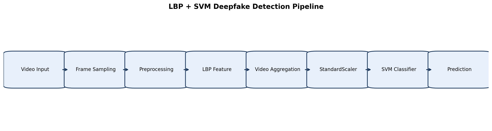
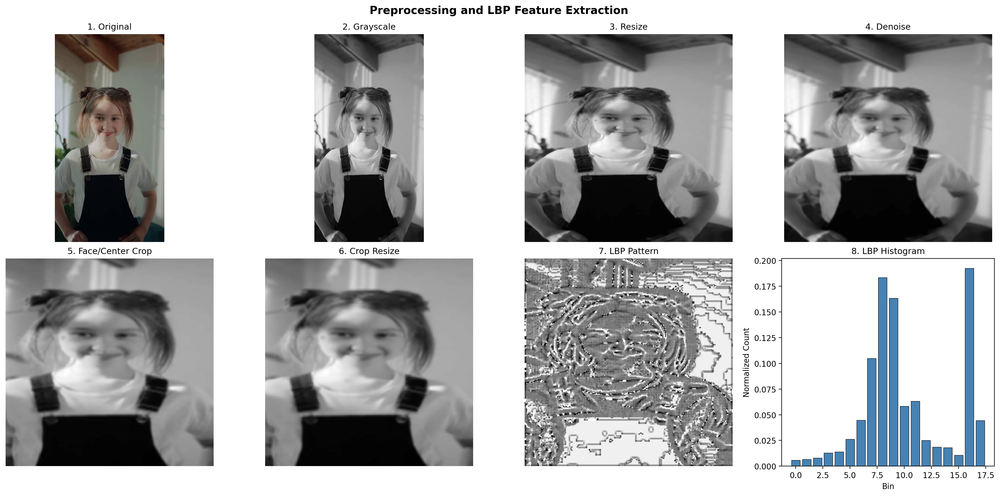
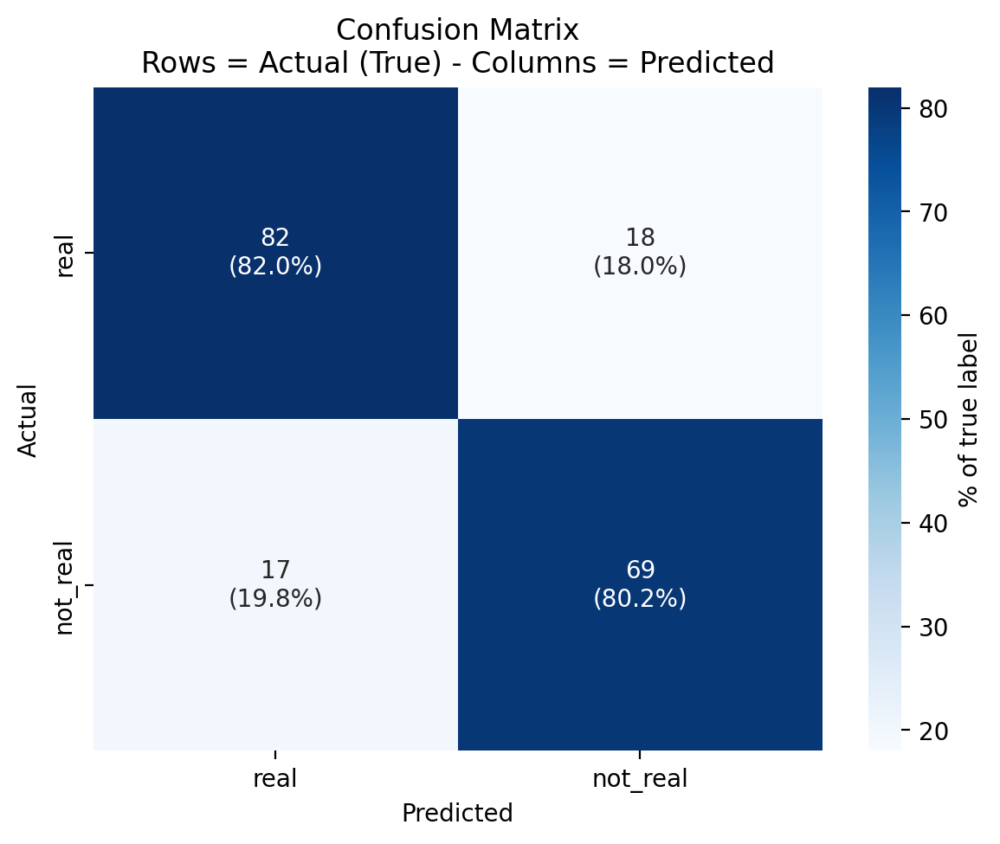
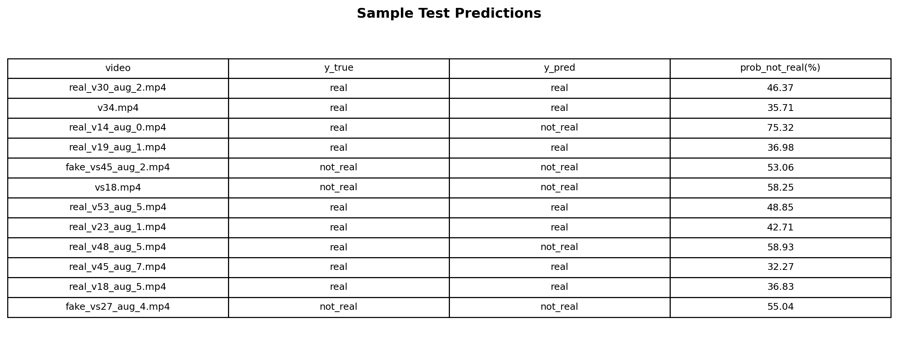

# Deteksi AI-Generated Video Menggunakan LBP + SVM

Proyek ini membangun pipeline klasifikasi video untuk membedakan video real dan AI-generated (deepfake) menggunakan fitur tekstur Local Binary Pattern (LBP) dan classifier Support Vector Machine (SVM).

## Ringkasan

- Tujuan: klasifikasi biner video menjadi `real` atau `not_real`
- Pendekatan: feature engineering berbasis LBP + model SVM
- Framework utama: OpenCV, scikit-image, scikit-learn
- Entry point:
  - Training: `train.py`
  - Prediksi satu video: `predict.py`

## Highlights

- Pipeline klasik yang ringan dan mudah dijelaskan untuk konteks penelitian.
- Feature extraction berbasis tekstur (LBP) pada level frame, lalu diagregasi ke level video.
- Training dan inferensi terpisah rapi untuk reproducibility.

## Alur Metode

`video -> frame sampling -> preprocessing -> optional face crop -> LBP per frame -> agregasi fitur video -> StandardScaler -> SVM -> evaluasi`

## Struktur Proyek (Inti)

```text
.
|-- train.py
|-- predict.py
|-- requirements.txt
|-- README.md
|-- docs/
|   |-- generate_readme_images.ipynb
|   `-- images/
|       |-- pipeline_overview.png
|       |-- preprocessing_stages.png
|       |-- confusion_matrix.png
|       `-- sample_predictions_table.png
|-- src/
|   |-- dataset.py
|   |-- features.py
|   |-- train.py
|   |-- predict.py
|   `-- utils.py
`-- outputs/
    `-- sdfvd2_best_v3/
        |-- config.json
        |-- metrics.json (opsional)
        `-- test_predictions.csv
```

## Setup Environment

```powershell
python -m venv .venv
.venv\Scripts\Activate.ps1
pip install -r requirements.txt
```

## Dataset

Struktur dataset yang direkomendasikan:

```text
data/
`-- sdfvd2.0/
	 |-- real/
	 `-- not_real/
```

Catatan:
- Folder dataset tidak disarankan untuk di-upload ke GitHub karena ukuran besar.
- Format kelas default di kode: `real` dan `not_real`.

## Cara Training

Contoh training utama:

```powershell
python train.py --dataset_root data/sdfvd2.0 --out_dir outputs/sdfvd2_best_v3 --reuse_features --svm_kernel linear --C 10 --class_weight balanced
```

Output penting yang dihasilkan:
- `outputs/sdfvd2_best_v3/model.joblib`
- `outputs/sdfvd2_best_v3/config.json`
- `outputs/sdfvd2_best_v3/test_predictions.csv`
- `outputs/sdfvd2_best_v3/train.log`

## Cara Prediksi Satu Video

```powershell
python predict.py --model outputs/sdfvd2_best_v3/model.joblib --video data/video_tes/sample.mp4
```

Hasil prediksi utama:
- Label akhir (`real` atau `not_real`)
- Probabilitas kelas (jika model menyediakan `predict_proba`)

## Reproducibility

Untuk hasil yang konsisten:
- Gunakan `random_state` tetap (default: `42`)
- Simpan dan gunakan `config.json` dari run terbaik
- Gunakan parameter feature extraction yang sama saat training dan inferensi

## Hasil dan Evaluasi

Metrik utama yang digunakan:
- Accuracy
- Precision, Recall, F1-score per kelas
- Confusion matrix

Sumber hasil evaluasi:
- `test_predictions.csv`
- `metrics.json`

## Visualisasi Hasil

### Pipeline Overview



### Preprocessing Stages



### Confusion Matrix



### Sample Predictions



## Re-generate Gambar

Jika ingin membuat ulang semua gambar README, jalankan notebook:

`docs/generate_readme_images.ipynb`

Notebook tersebut menghasilkan 4 file gambar berikut:

1. `pipeline_overview.png`
   - Diagram alur end-to-end dari video input sampai output klasifikasi.
2. `preprocessing_stages.png`
   - Visual tahapan preprocessing (original, grayscale, resize, denoise, face crop, LBP).
3. `confusion_matrix.png`
   - Heatmap confusion matrix pada test set.
4. `sample_predictions_table.png`
   - Cuplikan tabel hasil prediksi (video, label prediksi, confidence/probability).

## Limitasi

- Pendekatan berbasis LBP sensitif terhadap kualitas video, kompresi, dan pencahayaan.
- Generalisasi ke dataset/domain baru perlu validasi tambahan.
- Model klasik lebih ringan, tetapi biasanya kalah dari model deep learning pada skala data sangat besar.

## Rencana Pengembangan

- Benchmark dengan model CNN/ViT sebagai pembanding.
- Tambahkan evaluasi cross-dataset untuk uji generalisasi.
- Tambahkan API atau UI ringan untuk demo inferensi.

## Author

Ruminas99
